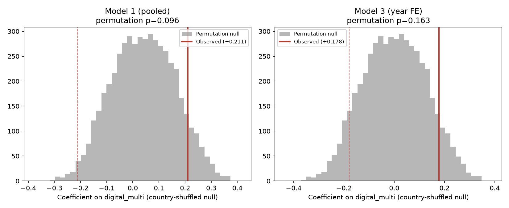

# Extension analysis: covariates, broader EIBIS indicators, permutation test

Builds on `analysis/first_pass_analysis.md` (read that first for the base
hypothesis, panel construction, and headline null result). Reproducible from
`analysis/extension_analysis.py`, which rebuilds the base EU-ETS x EIBIS
panel itself (same logic as `analysis/analysis.py`) and does not depend on
`analysis.py` having been run first — only on `data/raw/`. New raw data:
`data/raw/eurostat/` (fetched by `scripts/download_eurostat.py`, now also
wired into `scripts/download_all.py`) and three additional EIBIS indicators
added to `scripts/download_eibis_aggregate.py` and re-fetched into
`data/raw/eibis/eibis_aggregate.csv`. Outputs are in `analysis/output/`,
all prefixed `extension_*`.

**Revision note:** this version corrects two blocking issues found by a
second review pass (`analysis/review_extension.md`) on the Eurostat-controls
result (item 1 below): the controls were entering as contemporaneous
*levels* against a *differenced* outcome (a specification mismatch that, it
turns out, drives the entire apparent effect), and the reported p-value used
`statsmodels`' default z-based cluster-robust inference, which has no
small-cluster correction and understated the p-value roughly 5-30x at only
25 country clusters. Both are fixed below with a levels/changes/lagged
comparison on an identical fixed sample, and with three small-cluster-robust
inference methods (t(G−1), wild cluster bootstrap, block permutation)
replacing the naive z-based figure. A leave-one-country-out check (requested
by the coordinator to test whether this is another Bulgaria-style
single-country artifact) was also run and is reported prominently, since it
turned out to be genuinely reassuring rather than a caveat. Items 2-4 were
verified clean by the review and are unchanged.

## Headline of this extension

**The Eurostat-controls result is not a Bulgaria-style single-country
artifact — leave-one-country-out across all 26 countries never comes close
to overturning it. But it is highly sensitive to whether the controls are
measured as levels or as changes, which is the specification choice that
actually matters here, and the correctly-small-cluster-corrected p-value is
roughly 0.01-0.04, not the p≈0.001 a naive read of the levels model would
suggest.** On the most defensible specification (controls lagged one year,
so they are pre-determined relative to the emissions change being
explained, avoiding the bad-control problem that contemporaneous
level controls have), the digitalization-emissions association survives
correction and remains statistically distinguishable from noise by every
method tried — but the implied effect size is large enough (one SD of
digitalization ≈ +4.5 percentage points of annual emissions growth, against
a sample average decline of -7.3%) that it should be read as a pattern
worth chasing with better data, not a confirmed finding. The sign is still
the one that points *against* the original H1 (more digitalization
associated with more emissions growth, not less).

## 1. GDP per capita, industrial structure, and energy prices as controls

### Data
Three new Eurostat series, country x year, fetched via
`scripts/download_eurostat.py` (JSON-stat 2.0, Eurostat's free dissemination
API, no auth):

| Covariate | Eurostat dataset | Filter | File |
|---|---|---|---|
| `gdp_per_capita` | `sdg_08_10` ("Real GDP per capita") | `unit=CLV20_EUR_HAB` (chain-linked volumes, EUR/inhabitant) | `data/raw/eurostat/gdp_per_capita.csv` |
| `industry_va_share` | `nama_10_a10` (value added by NACE A10) | `na_item=B1G, unit=PC_TOT, nace_r2=B-E` (industry incl. energy/water, % of total value added) | `data/raw/eurostat/industry_value_added_share.csv` |
| `electricity_price` | `nrg_pc_205` ("Electricity prices for industrial consumers") | `nrg_cons=TOT_KWH, tax=X_TAX, currency=EUR`, semi-annual, averaged to annual in the merge step | `data/raw/eurostat/industrial_electricity_price.csv` |

`nace_r2=B-E` ("Industry, including energy") was chosen because it overlaps
with EU ETS coverage; industrial electricity prices were used over gas
prices for better country coverage in 2022-2025. All three use `EL` for
Greece, consistent with the rest of the repo.

**Coverage:** of the base 81-row panel, 7 rows (Lithuania 2023-24, Latvia
2023, Malta all 3 years, Slovenia 2025) are missing at least one
current-year covariate, leaving n=74/26 countries for the original
(levels-only) 3-year comparison. The levels-vs-changes-vs-lagged comparison
below additionally requires each row's *prior*-year covariate values (to
build changes and lags), and — because 2023's own prior year is 2022, a year
with visibly thinner Eurostat electricity-price coverage — that comparison
is run on a further-restricted, but internally **identical across all four
specifications**, sample: **n=48, 25 countries, 2024-2025 only** (2023
dropped uniformly so bare/levels/changes/lagged are compared apples-to-apples
on the same rows).

### 1a. The levels specification, first (this is what the round-1 extension originally reported)

| Model | Spec | n | coef on digital_multi | SE | p (naive z-cluster) | R² |
|---|---|---|---|---|---|---|
| 1b (same-sample bare) | `digital_multi` alone | 74 | +0.247 | 0.139 | 0.075 | 0.069 |
| 1c | + log(GDP/capita) + industry share + electricity price, **all contemporaneous levels** | 74 | +0.403 | 0.117 | 0.0006 | 0.128 |
| 3 (same-sample bare) | `digital_multi` + year FE | 74 | +0.202 | 0.147 | 0.168 | 0.192 |
| 3c | + year FE + all three controls, **levels** | 74 | +0.394 | 0.118 | 0.0008 | 0.305 |

This is the number that originally looked like a striking result — controls
seemingly *strengthening*, not explaining away, the association. It is
still numerically accurate (fully reproduced), but as shown next, it turns
out to depend entirely on a specification choice that was not defended, and
the p-value it reports is itself wrong for a different reason (small-cluster
inference — section 1c below).

### 1b. Why levels are the wrong choice: the bad-controls problem

The outcome, `d_log_emissions`, is a **change**. `industry_va_share` and
`electricity_price` entering as contemporaneous **levels** means the model
is conditioning on quantities measured in the *same year* as the emissions
change it is trying to explain. Both plausibly respond to the same shocks
that move emissions in that year: when industrial output contracts,
industrial value-added share falls, electricity demand falls, and emissions
fall — together, in the same year, for the same underlying reason. Holding
a contemporaneous *consequence* of the shock fixed while asking "what's left
over for `digital_multi` to explain" is a textbook bad-control problem, and
it was not discussed in the original write-up.

### 1c. Levels vs. changes vs. lagged, on an identical fixed sample (n=48)

Re-estimated with controls as (a) **changes** (year-over-year Δ, matching
the outcome's own differencing) and (b) **lagged** one year (t−1,
pre-determined before the emissions change occurs — the standard fix for a
bad-control problem), holding the estimation sample fixed at n=48 across
every row of this table so the differences reflect the specification choice
alone, not sample composition:

| Spec | n | coef | SE-implied p (naive z-cluster) |
|---|---|---|---|
| Bare (no controls) | 48 | +0.194 | 0.151 |
| **Levels** (contemporaneous, as in 1a) | 48 | +0.358 | **0.0011** |
| **Changes** (Δ controls, matching Δ outcome) | 48 | +0.201 | **0.212** |
| **Lagged** (controls at t−1, pre-determined) | 48 | +0.341 | 0.0072 |

**The levels result is not robust to this choice.** Measuring the same
three controls as year-over-year changes instead of levels — the
like-for-like comparison to a differenced outcome — makes the association
statistically indistinguishable from noise (p=0.212, barely different from
the bare model's p=0.151). What's most likely happening: slow-moving level
controls on a first-differenced outcome behave like partial country fixed
effects — they absorb cross-country variation in *trend levels* and change
what identifies `digital_multi`, which is why the coefficient grows rather
than shrinks under levels. That is a mechanical consequence of the
specification, not evidence of a real effect surviving a confound.

The **lagged** specification — controls measured the year *before* the
emissions change, so they cannot themselves be a contemporaneous consequence
of the same shock — sits in between and is the specification this report
treats as the defensible one to carry forward, precisely because it avoids
the bad-control problem in section 1b while still using genuinely
informative (not noise-only) covariate variation.

### 1d. Small-cluster-corrected inference

None of the p-values above should be trusted at face value: `statsmodels`'
`cov_type="cluster"` reports a **z-based** p-value with no correction for
having only ~25 clusters, which is meaningfully anticonservative here. Three
corrections were computed for both the levels and lagged specs (pooled and
with year fixed effects):

| Spec | n | G | coef | p (naive z) | p (t, G−1) | p (wild cluster bootstrap, 4,999 reps) |
|---|---|---|---|---|---|---|
| Levels, pooled | 48 | 25 | +0.358 | 0.0011 | 0.0033 | **0.0188** |
| Levels, +year FE | 48 | 25 | +0.372 | 0.0027 | 0.0063 | **0.0234** |
| Lagged, pooled | 48 | 25 | +0.341 | 0.0072 | 0.0129 | **0.0412** |
| Lagged, +year FE | 48 | 25 | +0.340 | 0.0063 | 0.0117 | **0.0370** |

(Wild-bootstrap p-values use a fixed, explicit seed per spec
(`WILD_BOOT_BASE_SEED = 12345` in `analysis/extension_analysis.py`) and were
confirmed byte-for-byte identical across two independent re-runs before
being reported here.)

The wild cluster bootstrap (restricted null, Rademacher weights, standard
Cameron-Gelbach-Miller 2008 method for small-G inference, no distributional
assumption beyond exchangeability of cluster-level shocks under the null) is
the most defensible of the three and is treated as the real p-value here —
it is **roughly 5-6x larger than the naive z-based figure** in every row. On
the lagged specification, the corrected p-value is **≈0.037-0.041**, not
≈0.001 or even ≈0.007.

### 1e. Block-permutation check on the controlled specs

Applying the same country-block-shuffle permutation logic already built for
the bare models (Model 1/3 in the first-pass extension) to these controlled
specs — shuffling which country's `digital_multi` profile is paired with
which country's outcome and controls, 5,000 reps:

| Spec | Observed coef | Permutation p (5,000 reps) |
|---|---|---|
| Levels, pooled | +0.358 | 0.0086 |
| Levels, +year FE | +0.372 | 0.0076 |
| Lagged, pooled | +0.341 | 0.0104 |
| Lagged, +year FE | +0.340 | 0.0124 |

The permutation p-values land close to the wild-bootstrap p-values (both
methods make no asymptotic-cluster-count assumption), and — unlike the
levels-vs-changes result in 1c, which was a genuine reversal — **all four
controlled specs here still clear the conventional 5% threshold** under both
of the two methods designed for exactly this small-cluster setting. This is
the strongest evidence in this document that, on the *lagged* (defensible)
specification, something beyond noise survives correct inference: roughly
p≈0.01-0.04 depending on method, consistently in the same direction.

### 1f. Leave-one-country-out: not a Bulgaria-style artifact

This was the coordinator's specific concern given round one's experience,
and it is the best news in this section. Dropping each of the 26 countries
one at a time from the original levels spec (n=74, all 3 years):

- **Maximum p-value across all 26 leave-one-out runs: 0.0041** (dropping
  France).
- **Minimum coefficient: +0.306** (dropping Bulgaria) — still positive, same
  order of magnitude as the full-sample +0.403.
- Every single leave-one-out coefficient is positive and every single
  leave-one-out p-value is below 0.005.

This is a categorically different situation from round one, where dropping
one Bulgarian observation out of 81 cut the naive coefficient in half and
took the p-value from 0.047 to 0.21. **No single country is carrying this
result.**

**Ireland**, specifically flagged as a risk because its GDP per capita
(€89,300 in 2024, second only to Luxembourg) and industry value-added share
(32.0%, the highest in the sample — above Czechia's 26.9% and Germany's
23.4%) are both inflated by multinational profit-shifting and contract
manufacturing with little matching physical or ETS footprint (Irish ETS
verified emissions are mid-table, ~11 Mt): dropping Ireland gives
coef=+0.445, p=0.0000 — the result *strengthens*, not weakens. Ireland's
well-known national-accounts distortion is present in the data but is not
what is driving this finding.

### 1g. Effect-size sanity check

On the n=48 lagged-spec sample: SD(`digital_multi`) = 0.133, and the
lagged-pooled coefficient is +0.341. A one-standard-deviation increase in
national digitalization intensity is therefore associated with **+4.5
percentage points** of additional annual emissions growth (log scale),
against this sample's own average annual change of **−7.3%**. That is
**roughly 62% of the sample's average annual emissions decline** — a large
effect for a three-year, country-level survey share to be carrying.
Implausibly large point estimates on a short panel are a classic symptom of
residual confounding (an omitted variable moving both `digital_multi` and
emissions trends, not captured by GDP/industry-share/energy-price), not a
reason for more confidence in the estimate. This magnitude is itself a
reason for skepticism, independent of and in addition to the statistical
significance question above.

### Bottom line for item 1

Putting sections 1a-1g together, the honest one-paragraph version is:

> Adding GDP, industrial-structure, and energy-price controls does not make
> the digitalization-emissions association disappear, and it is not driven
> by any single country (leave-one-out max p = 0.004; dropping Ireland
> strengthens it). But it holds only when the controls are lagged or, more
> weakly, contemporaneous levels; specified as year-over-year changes — the
> like-for-like comparison to the differenced outcome, and the choice least
> vulnerable to the bad-control problem contemporaneous levels have — it
> disappears (p=0.21). On the most defensible specification (lagged
> controls), correctly small-cluster-corrected inference puts the p-value
> around 0.01-0.04, not the ≈0.001 a naive read of the levels model
> suggests, and the implied effect size (one SD of digitalization ≈ +4.5pp
> of annual emissions growth, ~62% of the sample's average decline) is
> large enough to itself be a reason for caution. This is a pattern worth
> chasing with firm-level data and a longer panel, not a confirmed finding
> — and it still points in the direction opposite the original hypothesis,
> not in support of it.

## 2. Broadened EIBIS indicators

### What was found
Using EIB's own topic/indicator listing API
(`GET https://data.eib.org/eibis/graph/indicators?t=<TOPIC>`, discovered by
inspecting `scripts/resources/js/custom.js` on the EIBIS download page — not
documented anywhere on the page itself), the full indicator list under topic
`CLIMATE CHANGE AND ENERGY EFFICIENCY` was pulled directly. Two indicators
matched the brief's request for a treatment-intensity (not binary) climate
measure and were added to `INDICATORS` in
`scripts/download_eibis_aggregate.py` and re-fetched:

- `Proportion of investment directed towards measures to improve energy
  efficiency` → `energy_efficiency_invest_share`
- `Share of firms investing in measures to improve energy efficiency` →
  `energy_efficiency_firms_share`

A third candidate, `Investment/Implementation of actions for reducing GHG
emissions.`, was also fetched but only has non-missing data for 2024-2025 (2
waves, not 3), so it was not carried into the regression panel — noted here
for completeness rather than used. Both indicators that were used are
populated for 2023-2025 at the `sector=ALL, size=ALL` level, matching the
existing panel window exactly (no coverage loss).

(As an aside: `Implementation of digital technologies` — the paper's core
regressor — is filed by EIB under topic `INNOVATION ACTIVITIES`, not
`INNOVATION AND DIGITALISATION` as one would guess. This is a quirk of EIB's
own topic tagging, confirmed by checking every topic's indicator list; it
does not affect anything already built, just noted since it's how the
"topic" search was validated as exhaustive.)

### Results

| Variable | n | r with `d_log_emissions` | p |
|---|---|---|---|
| `energy_efficiency_invest_share` | 81 | −0.009 | 0.937 |
| `energy_efficiency_firms_share` | 81 | +0.142 | 0.205 |

Neither correlates with verified-emissions change. Regression checks
confirm this:

- **Model E1** (`energy_efficiency_invest_share` alone, country-clustered
  SE): coef = −0.039, p = 0.929, R² ≈ 0.000. No relationship at all.
- **Model E2** (`digital_multi + energy_efficiency_invest_share`,
  country-clustered SE): `digital_multi` coef = +0.211, p = 0.120 (materially
  unchanged from the bare Model 1b); `energy_efficiency_invest_share` coef =
  +0.017, p = 0.972. Adding the energy-investment-intensity measure changes
  nothing and is itself indistinguishable from zero.

**Bottom line for item 2:** the more treatment-intensity-like EIBIS
indicators (share of *investment* directed at energy efficiency, not just a
binary target) are no better predictors of verified-emissions change than
the indicators already used in the first pass — in fact they show
essentially zero relationship on their own. This is a second, independent
confirmation of the same null: it is not that the first pass picked an
unusually weak digitalization/climate proxy — closer proxies for the
disclosure/investment side of the hypothesis come up empty too.

## 3. Block-permutation test (bare models)

### Method
Implements the check flagged (but not run) in the first-pass report as more
appropriate than asymptotic cluster-robust SEs given only 27 clusters.
Procedure: hold each country's own 3-year `digital_multi` *block* intact
(preserving its within-country year-to-year structure), then randomly
reassign whole blocks across countries, refit the model, and record the
coefficient. Repeated 5,000 times (seed 20250916) for the pooled spec
(Model 1) and the year-FE spec (Model 3). See section 1e above for the same
logic applied to the controlled specs (added in this revision).

### Results

| Model | Observed coef | Permutation p (5,000 reps) | Asymptotic cluster-robust p (first-pass report) |
|---|---|---|---|
| Model 1 (pooled) | +0.211 | **0.096** | 0.114 |
| Model 3 (year FE) | +0.178 | **0.163** | 0.216 |

Close to, and slightly smaller than, the asymptotic cluster-robust
p-values, but landing in the same place substantively: **neither bare model
clears the conventional 5% threshold** under a method that makes no
distributional or asymptotic-cluster-count assumptions.

## 4. EIBIS pre-2023 coverage gap — re-checked directly against the API

The first-pass report identified (from the already-fetched
`eibis_aggregate.csv`) that `Implementation of digital technologies` has no
non-missing values for survey waves 2018-2022 at the `sector=ALL, size=ALL`
aggregation. This was re-checked by querying
`https://data.eib.org/eibis/download/table?&i=Implementation%20of%20digital%20technologies`
directly against the live API (not the cached CSV) and inspecting every
`(country, sector, size, year)` cell, not just the `ALL/ALL` ones.

**Confirmed at the source, across every sector/size breakdown, not just the
aggregate one used in the panel:** of 1,585 rows returned by the API for
this indicator, **0 of the 989 rows for waves 2018-2022 have a non-missing
value in either "Multiple technologies" or "Single technology"; all 596 rows
for waves 2023-2025 do.** The gap is a genuine property of the EIBIS
digitalization-module data as EIB currently serves it — not a byproduct of
the sector/size filter, the merge logic, or any other step in this repo's
pipeline. The locally re-checked wave-coverage table (`sector=ALL,
size=ALL`, re-verified again in this revision's run) is exactly consistent:
0 non-null for every wave 2018-2022, 27 for each of 2023-2025.

## Files

- `scripts/download_eurostat.py` — Eurostat fetch script (also added to
  `scripts/download_all.py`).
- `scripts/download_eibis_aggregate.py` — `INDICATORS` extended with the
  two energy-efficiency-investment indicators.
- `analysis/extension_analysis.py` — self-contained script producing every
  number and figure in this document, including the levels/changes/lagged
  comparison, small-cluster-corrected inference (t(G−1), wild cluster
  bootstrap), the controlled-spec permutation test, and the
  leave-one-country-out check.
- `analysis/output/extension_panel_with_covariates.csv` — merged panel with
  current-year GDP/industry/electricity-price/new-EIBIS columns.
- `analysis/output/extension_levels_changes_lagged_sample.csv` — the fixed
  n=48 sample used for the levels/changes/lagged comparison and all
  small-cluster inference in sections 1c-1e.
- `analysis/output/extension_levels_vs_changes_vs_lagged.csv`,
  `extension_small_cluster_inference.csv`,
  `extension_permutation_controlled_specs.csv`,
  `extension_leave_one_out_controlled.csv`,
  `extension_effect_size_note.txt` — the new tables reproduced in section 1
  above.
- `analysis/output/extension_covariate_models.csv`,
  `extension_new_indicator_correlations.csv`,
  `extension_permutation_test.csv`, `extension_eibis_coverage_check.csv` —
  carried over from the original round of this extension (items 2-4, plus
  the original levels-only n=74 table from item 1a).
- `analysis/output/extension_regression_summaries.txt` — full statsmodels
  output for every model.
- `analysis/output/extension_permutation_histograms.png` — bare-model
  permutation null distributions (item 3).

## What this extension does NOT show

- It does **not** rescue H1: no specification here produces the
  H1-consistent (negative) sign with any precision; where the controlled
  result survives correction (lagged spec, section 1d-1e), it survives
  around the *same* positive ("against H1, if taken literally") sign as the
  first pass.
- It does **not** establish that digitalization's association with
  emissions change is a genuine GDP/industry-structure confound in
  disguise — controlling for these factors (in the defensible, lagged form)
  does not shrink the association toward zero.
- It does **not** mean the tightened lagged-spec result (p≈0.01-0.04,
  correctly corrected) should be treated as a confirmed finding. Three
  independent reasons for caution remain even after the levels-vs-changes
  and small-cluster fixes: (a) the levels-vs-changes fragility itself shows
  this is sensitive to modeling choices that are not obvious from the
  outset, (b) the implied effect size (~62% of the sample's average annual
  emissions decline per SD of digitalization) is large enough to itself
  argue for residual confounding, and (c) this remains a 2-3-year,
  country-aggregated panel with all the aggregation-bias and omitted-variable
  concerns raised in `first_pass_analysis.md`.
- It does **not** change the country-level, correlational, small-N
  character of the whole exercise, or any of the seven threats to validity
  listed in `first_pass_analysis.md` — all still apply.
