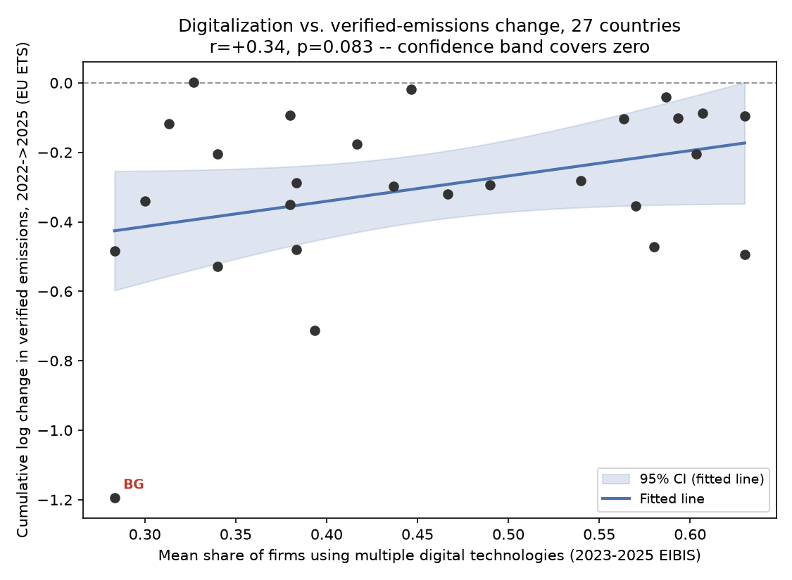

# First-pass analysis: digitalization intensity and verified emissions (country-panel)

Reproducible from `analysis/analysis.py`, run against `data/raw/`. Output
tables and the headline figure are in `analysis/output/`.

**Revision note:** this version corrects two errors flagged by review
(`analysis/review.md`): (1) the hypothesis statement's direction was stated
inconsistently with the sign of the outcome variable, which would have led a
reader to interpret the one nominally-significant result backwards; (2) the
one p<0.05 result (Model 1) used heteroskedasticity-robust but not
cluster-robust standard errors, which overstates precision given the panel
has only 27 independent country clusters. Both are fixed below, along with
several secondary fixes (leave-one-out check, corrected Model 4 SEs, a
variance-decomposition justification for demoting two-way FE, and a headline
scatter figure). The underlying data pipeline (country-code reconciliation,
the `20-99` double-count trap, the E-PRTR biomass filter, the EIBIS
pre-2023 coverage gap) was independently re-verified by review and is
unchanged.

## Hypothesis

**H1:** At the country-year level, a country's digital-technology adoption
intensity (EIBIS: share of firms reporting *multiple* digital technologies
implemented) is associated with a **more negative** year-over-year change in
its EU ETS *verified* (independently audited) emissions — i.e.,
more-digitalized country-years show smaller emissions increases or larger
emissions decreases than less-digitalized country-years, net of common
EU-wide shocks. Concretely: **H1 predicts a negative coefficient** on
`digital_multi` when the outcome is `d_log_emissions` (year-over-year change
in log verified emissions), because a negative change in log-emissions is a
*decrease*.

This is deliberately framed as a **correlational, descriptive, country-panel**
hypothesis, not a causal claim. The unit of analysis is a country-year, not a
firm, so "digitalization causes emissions cuts" is not something this data
can test — only whether the two series co-move across countries and years.

**H0 (the "disclosure vs. reality" question this dataset can speak to):**
if H1 fails while a parallel relationship with *self-reported/disclosed*
climate ambition (e.g., EIBIS "climate change targets for own GHG emissions"
share) succeeds, that would be suggestive (not proof) that digitalization
correlates with reported climate ambition without a matching signal in
audited outcomes. In this pass, neither the ETS nor the disclosure-adjacent
covariate reaches significance in the richer models, so we do not have
grounds to claim even that weaker pattern (see Results).

## Data & Methods

### Sources used
- **EU ETS verified emissions** (`data/raw/eu_ets/eu-ets.csv`): filtered to
  `citl_information == "2. Verified emissions"` and
  `main_activity_code == "20-99"` (this code is *already* the country total
  across all stationary installations — combustion (`20`) + all other
  industrial activities (`21-99`) — so it is used directly as the country-year
  total rather than re-summed with its own components, which would double
  count). Aviation (`main_activity_code == "10"`) and non-country rows
  (`Innovation fund`, `Modernisation Fund`, `NER 300 auctions`, `RRF`) are
  excluded. Outcome: `d_log_emissions` = year-over-year change in
  log(verified emissions), i.e. an approximate percentage change, computed
  within each country's own time series. **A negative value means emissions
  fell; a positive value means emissions rose.**
- **EIBIS aggregate** (`data/raw/eibis/eibis_aggregate.csv`): restricted to
  `sector == "ALL"` and `size == "ALL"` (the country-wide aggregate, not a
  sector/size cell), and to the 27 EU member-state country codes (the file
  also carries `EU`-aggregate and `US` rows, now explicitly filtered out
  rather than relying on them failing to match in the merge). Digitalization
  regressor: `digital_multi` = share of firms reporting "multiple
  technologies" implemented (indicator `Implementation of digital
  technologies`). Secondary covariates: `genai_share` (share of firms using
  generative AI), `climate_target_share` (share with own GHG targets — the
  "disclosed ambition" proxy).
- **E-PRTR national air releases** (`data/raw/eprtr/F1_1_Air_Releases_National.csv`):
  used as a secondary/appendix outcome only (see Results — it is not
  informative on its own). Filtered to "Carbon dioxide (CO2) excluding
  biomass" and aggregated to country-year; `d_log_co2` computed the same way
  as the ETS outcome.
- **JRC-EU-ETS-FIRMS crosswalk**: inspected but **not used**. It only
  contains ETS-account-holder ↔ ORBIS firm-ID pairs, no financials or names
  usable without a separate institutional ORBIS license, so it cannot
  currently support a firm-level merge. Noted as a limitation, not forced.

### Country-code reconciliation
- EU ETS uses `GR` for Greece; EIBIS/EU official code lists use `EL`. Mapped
  `GR -> EL` in the ETS panel before merging.
- EU ETS also contains `GB` (UK), `XI` (Northern Ireland), and EEA/EFTA
  members `NO`, `IS`, `LI`, none of which appear in EIBIS (EIBIS covers EU27
  + US only, no UK/EEA rows) — these ETS country-years simply have no EIBIS
  match and drop out of the merged panel (this is intentional, not a bug).
- E-PRTR uses full country names (`countryName`); mapped to EU 2-letter codes
  by hand (`NAME_TO_CODE` dict in `analysis.py`), including `Greece -> EL`.

### A key, non-obvious data-coverage finding
The EIBIS "Implementation of digital technologies" question, at the
country-wide (`sector=ALL`, `size=ALL`) aggregation level, **only has
non-missing values for survey waves 2023, 2024 and 2025** — waves 2018–2022
are entirely `NaN` for this cell in the aggregate file, even though the
`indicator` label exists for those years (the question/reporting format
evidently changed). This is not visible from the README and was discovered
by inspection, then independently re-verified in review. Practically, it
collapses the usable panel from a notional "2018–2025 x ~29 countries" to an
**actual 3-year, 27-country panel (2023–2025)**. `genai_share` is populated
for **2025 only** (n=27), which is why any model including it drops to n=27
and effectively becomes a single-year cross-section.

### Final merged analysis panel
- EU-ETS x EIBIS panel: **81 observations** = 27 countries x 3 years
  (2023, 2024, 2025), balanced.
- E-PRTR x EIBIS panel: **17 observations**, ~10 country clusters, used
  only in the appendix as a directional check, not a primary result.

### On standard errors — the central methodological point of this revision
The panel has 27 countries observed over 3 years each; the three
observations per country are not independent (a country's 2023, 2024, 2025
verified-emissions changes share the same industrial base, energy mix, and
survey respondents). **Every model below is fit with standard errors
clustered by country**, which is the report's stated and consistently-applied
standard from Model 3 onward. Model 1 is additionally shown with plain
heteroskedasticity-robust (HC1) standard errors — which wrongly treat all 81
rows as independent — specifically to show how much of the naive
significance was an artifact of ignoring the panel structure. Model 2 is an
exception where HC1 is the *only* sensible choice, because it effectively
collapses to a single cross-section (one observation per country; see above).

### Models estimated
1. Pooled OLS, `d_log_emissions ~ digital_multi`, shown both with HC1 and
   with country-clustered SEs — **the country-clustered version is the
   headline number**, HC1 is shown alongside only for comparison.
2. Pooled OLS adding `genai_share` and `climate_target_share` (HC1 SE,
   n=27, effectively a single cross-section — see above).
3. OLS with year fixed effects, country-clustered SEs — the primary,
   most-defensible panel specification (absorbs EU-wide shocks common to a
   given year, e.g. the 2023-24 energy-price/industrial-slowdown period).
4. *(Appendix, not headline)* OLS with **both** country and year fixed
   effects (two-way FE), country-clustered SEs. See "Why two-way FE is
   demoted" below for why this specification is not treated as a serious
   test of H1 here.
5. *(Appendix, not headline)* Robustness check using the E-PRTR CO2 change
   as the outcome instead of EU ETS, country-clustered SEs.

Additional checks: a leave-one-out fragility test on Model 1, and a
between/within variance decomposition of `digital_multi` to quantify why
two-way FE cannot work with a 3-year panel.

## Results

### Headline figure

27 countries, mean `digital_multi` (2023–2025 average) on the x-axis,
cumulative log change in verified emissions from 2022 to 2025 on the y-axis
(a negative y-value means emissions fell over the period). **r = +0.340,
p = 0.083.** The fitted line slopes upward: more-digitalized countries sit
closer to zero (smaller emissions declines), less-digitalized countries sit
lower (larger emissions declines) — read literally, that is a faint tilt
*against* H1, not for it (see "Reading the sign," next). But the shape
matters more than the tilt: **the 95% confidence band visibly covers zero
across almost the entire range of the data**, and Bulgaria (the extreme
bottom-left point) is doing a disproportionate amount of work to keep the
line separated from flat at all. This one picture is the most honest summary
of the whole analysis: on this data, there is no detectable relationship
between country-level digitalization intensity and country-level
verified-emissions trends.

### Reading the sign correctly

`digital_multi`'s coefficient on `d_log_emissions` is **positive** in every
headline specification (Models 1–3) and in the cross-sectional scatter above.
Because the outcome is a *log change* in emissions, **a positive coefficient
means more-digitalized country-years are associated with emissions *growing
more* (or falling less)** — the opposite of what H1 predicts. Taken at face
value and only if one were (incorrectly) willing to treat any of these
numbers as significant: **more-digitalized countries in this sample cut
verified emissions somewhat less, not more.** As shown immediately below,
none of these numbers survive correct standard errors or a basic fragility
check, so this reading should not be taken as a finding either — but it is
the correct reading of what a positive sign says, and an earlier draft of
this report stated the hypothesis in a way that would have led a reader to
interpret it backwards.

### Correlations (Pearson, with `d_log_emissions`)

| Variable | n | r | p |
|---|---|---|---|
| digital_multi | 81 | +0.221 | 0.047 |
| digital_any (multi+single) | 81 | +0.173 | 0.123 |
| genai_share | 27 | +0.182 | 0.363 |
| climate_target_share | 81 | +0.154 | 0.171 |

Only `digital_multi` clears the naive p<0.05 threshold, and only marginally
— and with four tests run, a Bonferroni-corrected threshold would be
α=0.0125, which nothing here clears even before the SE correction below is
applied.

### Headline regression table (country-clustered SEs)

| Model | Spec | n | coef on digital_multi | SE | p | R² |
|---|---|---|---|---|---|---|
| 1a | Pooled OLS, HC1 (naive, NOT preferred) | 81 | +0.211 | 0.106 | **0.047** | 0.049 |
| 1b | Pooled OLS, **country-clustered** (preferred) | 81 | +0.211 | 0.134 | **0.114** | 0.049 |
| 2 | + genai_share + climate_target_share (single cross-section, HC1) | 27 | +0.385 | 0.257 | 0.134 | 0.071 |
| 3 | + year FE, country-clustered (primary panel spec) | 81 | +0.178 | 0.144 | 0.216 | 0.135 |

**Headline finding: the one nominally-significant result (Model 1a, p=0.047)
is not a finding.** It disappears as soon as standard errors acknowledge
that the panel has only 27 independent country clusters rather than 81
independent rows (Model 1b, p=0.114) — this happens *before* any fixed
effects are added. Adding year fixed effects (Model 3) leaves the point
estimate similar (+0.178) and the p-value similarly non-significant (0.216).
**No specification in the primary table clears conventional significance.**

### Fragility check: leave-one-out on the naive Model 1a

| Sample | n | coef | p (HC1) |
|---|---|---|---|
| Full sample | 81 | +0.211 | 0.047 |
| Drop Bulgaria 2025 only | 80 | +0.170 | 0.086 |
| Drop Bulgaria entirely (all 3 years) | 78 | +0.110 | 0.210 |

Even setting aside the clustering issue, the one significant p-value in the
whole exercise is not robust to removing **a single observation out of 81**
(Bulgaria 2025, the most extreme point in the scatter above, and the
highest-Cook's-D point identified in diagnostics below). Two independent
routes — correct clustering, and dropping one country — both kill the
result. That is a strong, convergent signal that Model 1a's p=0.047 was
noise, not evidence.

### Appendix specifications (not headline — see rationale below each)

**Model 4 — two-way (country + year) fixed effects, country-clustered SE:**
coef = **-0.348**, SE = 0.280, **p = 0.214**, R² = 0.596, n=81. This is the
only specification where the sign flips to match H1's predicted (negative)
direction, but it is not significant, and — as shown by the variance
decomposition below — it is not a meaningful test of the hypothesis at all.

*Why two-way FE is demoted to appendix, not headline:* decomposing
`digital_multi`'s variance shows a between-country SD of **0.117** versus a
mean within-country SD of only **0.051**. Country fixed effects absorb the
between-country variation, leaving a regressor whose residual variance is
roughly (0.051/0.117)² ≈ **19%** of the original. With only three annual
EIBIS survey waves per country and survey samples of a few hundred firms,
year-to-year wobble of a few percentage points in `digital_multi` is well
within ordinary sampling noise for the underlying survey. **Model 4 is
therefore mostly a regression of emissions changes on EIBIS sampling noise,
not on a meaningful change in digitalization.** Its sign flip should not be
read as evidence that digitalization *actually* helps once "confounds are
controlled for" — with T=3 there is essentially no clean within-country
signal left to identify off.

**Model 5 — E-PRTR CO2 robustness check, country-clustered SE:** coef =
+1.983, SE = 1.480, p = 0.180, n=17, ~10 country clusters. Directionally
consistent with the (non-significant) headline models, but cluster-robust
inference on roughly 10 clusters is not meaningful — this number should be
treated as uninformative, not as corroborating evidence.

Full statsmodels output for every model (including both Model 1 variants) is
in `analysis/output/regression_summaries.txt`. Underlying tables (panel
data, descriptives, correlations, VIF, influence diagnostics, leave-one-out,
variance decomposition, the scatter's underlying data) are in
`analysis/output/*.csv`.

### Diagnostics

- **Multicollinearity (Model 2 regressors):** VIFs of 3.13 (`digital_multi`),
  2.84 (`genai_share`), 1.82 (`climate_target_share`) — elevated but below
  the conventional 5-10 concern threshold; not the reason the model is
  insignificant.
- **Influential observations (Model 3):** 3 of 81 observations exceed the
  Cook's-D > 4/n (0.049) rule of thumb: Bulgaria 2025 (Cook's D=0.28, an
  order of magnitude more influential than any other point), Bulgaria 2023
  (0.099), and Estonia 2023 (0.076) — small country-year totals where a
  modest absolute change produces a large log-change. The leave-one-out
  check above confirms this is not just a diagnostic flag but actually
  drives the naive model's significance.
- **Residual normality (Model 3):** Shapiro-Wilk W=0.911, p<0.001 — residuals
  are non-normal (left-skewed, heavy-tailed), consistent with a few
  countries having very large one-year swings in verified emissions. All
  reported SEs are heteroskedasticity- or cluster-robust, which partially
  compensates, but with only 27 country clusters the cluster-robust SEs
  should themselves be treated as approximate — asymptotic cluster-robust
  inference is generally considered unreliable well below ~30-50 clusters,
  and this analysis has 27.

## Limitations & threats to validity

1. **Aggregation bias / ecological fallacy.** Every variable here is a
   country-wide average (EIBIS: share of *firms surveyed* in a country;
   ETS: sum across *all* covered installations in a country). A country-level
   correlation (or its absence) says nothing about whether *the same firms*
   that digitalize are the ones cutting emissions — it is fully consistent
   with, e.g., digitalizing firms and emissions-cutting firms being
   completely disjoint sets within each country.
2. **Very short, unbalanced-in-coverage panel.** The usable overlap is 3
   years (2023-2025) for 27 countries — a genuinely small-N, short-T panel.
   Two-way fixed effects (Model 4) leave only ~19% of the regressor's
   variance to identify off (see variance decomposition above), which is why
   it is treated as an appendix curiosity, not a serious specification.
3. **Omitted variables.** No controls for GDP per capita/growth, energy
   prices, sector/industrial composition, or the EU ETS cap's own
   linear-reduction-factor tightening (which mechanically pushes verified
   emissions down over time for *all* countries regardless of digitalization,
   and is only partially absorbed by year fixed effects since the cap
   affects different sectors differently). Model 2's attempt to add climate
   ambition and genAI covariates collapses to n=27 (a single year) and is
   not a real test of omitted-variable robustness.
4. **2023-2025 window is not "normal" macro history.** This period includes
   the tail of the post-COVID rebound, the 2022-23 European energy-price
   shock (which mechanically depressed industrial output and emissions
   independent of any digital or climate strategy), and phase-4 ETS cap
   tightening. Year fixed effects (Model 3) absorb EU-wide average shocks in
   a given year but not country-specific exposure to the energy shock (e.g.,
   gas-dependent vs. not), which could easily be correlated with both
   digitalization levels and emissions trends.
5. **Reverse causality / confounding by development level.** More
   digitalized economies also tend to be wealthier, more services-oriented,
   and have already de-industrialized more of their heavy-emitting base —
   any of these could drive both higher `digital_multi` and flatter/falling
   ETS emissions, independent of any digitalization -> efficiency channel.
   Nothing in this design can separate "digitalization causes cleaner
   emissions" from "countries that already have cleaner industrial mixes for
   unrelated historical/structural reasons also happen to be more
   digitalized."
6. **Firm-level linkage is not available.** The JRC-EU-ETS-FIRMS crosswalk
   in `data/raw/jrc_firms/` only maps ETS account holders to ORBIS firm IDs;
   it has no financials, sector detail, or names usable without a separate
   ORBIS license, so it cannot upgrade this to a firm-level analysis. EIBIS
   firm microdata (which does have both a digitalization and a climate
   module on the same firms) requires a separate proposal to EIB
   (`EIBIS_data_access@eib.org`) and is not in this repo.
7. **Small-cluster inference.** Cluster-robust SEs (Models 3, 4) are computed
   over 27 clusters, and Model 5 over roughly 10, both below where
   asymptotic cluster-robust standard errors are considered fully reliable;
   treat all reported p-values as approximate, not exact — if anything, this
   argues for even more skepticism toward the (already non-significant)
   headline numbers, not less.

## What this does NOT show

- It does **not** show that digitalization causes (or fails to cause)
  emissions reductions — the design is observational, country-level, and
  correlational only.
- It does **not** show that "disclosed" climate ambition (EIBIS
  `climate_target_share`) diverges from verified outcomes in a way that
  supports a "greenwashing" story — the covariate itself is never
  significantly associated with verified-emissions change either, so there
  is no basis here to claim disclosure and reality tell different stories;
  the honest read is that **neither is significantly associated once basic
  controls are added**.
- It does **not** establish a robust sign or magnitude for the
  digitalization-emissions relationship. Taken at face value the sign is
  positive (i.e., pointing *against* H1 — more digitalization associated
  with less emissions reduction) in every headline specification, but this
  positive sign is not statistically significant anywhere once standard
  errors correctly account for the panel structure, and it is not robust to
  dropping a single country. The one specification with the H1-consistent
  (negative) sign — the two-way FE appendix model — is itself not
  significant and is shown to be identified almost entirely off survey
  noise, not a meaningful signal.
- It does **not** use any firm-level data — every quantity is a country-wide
  average, so nothing here should be described as being about "firms," only
  about "countries in years when more of their surveyed firms report
  digital adoption."
- It does **not** rule out that a properly firm-matched panel (EIBIS
  microdata x ETS installation-level x ORBIS financials) would show a real
  effect — this first pass is underpowered by construction (small N,
  short T, country aggregation) to detect anything but a large, robust
  effect, and it did not find one.

## Suggested next steps (not done here)

- Submit the EIBIS firm-level microdata proposal (per `docs/data_sources.md`)
  to get within-country, firm-level digitalization and climate variables on
  the same respondents.
- If firm-level ETS/ORBIS linkage becomes available, re-run at the
  installation or firm level rather than the country level, which removes
  the aggregation-bias problem entirely.
- Add explicit controls for GDP per capita and an energy-price shock proxy
  once a suitable series is sourced, to partially address the omitted
  variable and 2022-23 energy-shock concerns.
- A block-permutation test (permuting whole country series across countries
  to preserve within-country dependence) would be a more credible robustness
  check than another asymptotic p-value on this small a panel — not run
  here, but a natural addition if this analysis is extended.
