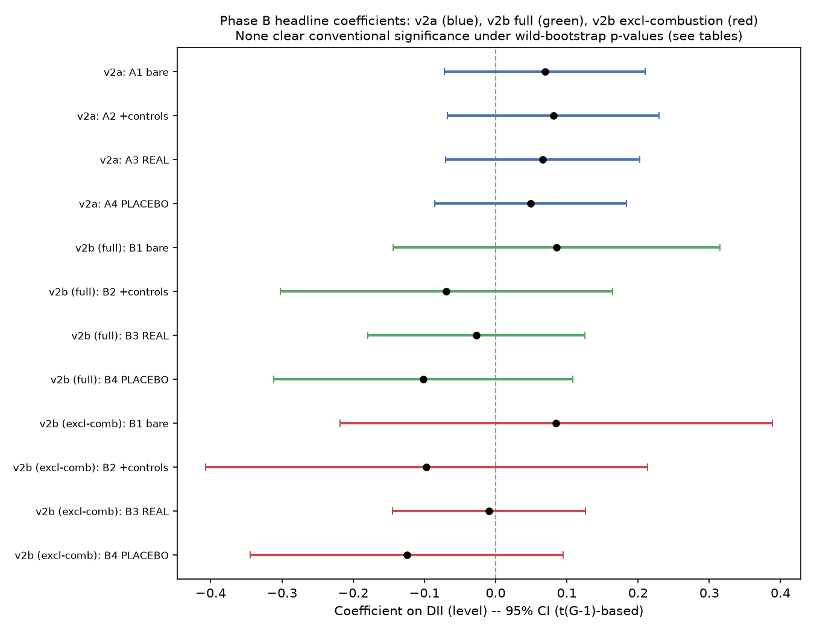

# Phase B: regression analysis on the DII-based panels (v2a, v2b)

Reproducible from `analysis/phase_b_analysis.py`, which loads the
Reviewer-approved panels from `analysis/output/panel_country_year_v2.csv`
(v2a) and `analysis/output/panel_sector_country_year_v2.csv` /
`panel_sector_country_year_v2_excl_combustion.csv` (v2b, both cuts). See
`analysis/panel_v2/panel_qc.md` and `panel_qc_review.md` for the panel
construction, coverage, and the three carried-forward constraints this
analysis obeys throughout (repeated below where relevant). This document
builds on, but does not replace, `analysis/first_pass_analysis.md` and
`analysis/extension_analysis.md` (the earlier EIBIS-based, 3-year,
country-only analysis).

**Revision note:** this version corrects four interpretive issues found by
a review pass (`analysis/phase_b_review.md`) — none of which changed the
headline null result (independently re-verified by the review: dropping
Norway, winsorizing the energy control, dropping it entirely, and
re-running the placebo test all left the DII coefficient in the +0.066 to
+0.085 range with p in 0.24-0.32). What changed is how four secondary
checks are described: (1) the placebo/lead comparison is now run on the
identical matched sample as the lagged/"real" spec, not two differently-
sized samples that happened to share a row count; (2) the v2a/v2b sign
divergence is now traced to a single specific control
(`accession_2004plus`) rather than attributed to generic "noise"; (3) the
EIBIS cross-check is now described as a measurement-consistency check
(the two measures correlate at r=0.709 on the overlap, so they are not
independent) rather than "triangulation"; (4) "rules out catch-up growth"
is corrected to "fails to detect, with limited power to do so" throughout,
and connected explicitly to finding (2).

## Headline

**The null result from the country-level EIBIS analysis replicates and, if
anything, gets cleaner.** Across both panels (v2a: 11-year country panel;
v2b: sector-country-year panel, both the full 7-sector cut and the
excl-combustion cut), across every specification (bare, with controls,
lagged, placebo, convergence-interaction), and under three separate
small-cluster-robust inference methods, **no coefficient on the Digital
Intensity Index reaches conventional significance anywhere.** Every 95%
confidence interval in the headline figure (below) straddles zero. This is
a *cleaner* null than the first-pass EIBIS analysis, which had one
naive-significant result (p=0.047) that dissolved under correct inference
— here, nothing was ever significant even under the naive z-based p-value
(minimum across every model: 0.199), so there is no fragile result to
interrogate in the first place.

The placebo (Granger-style) test, run on a sample matched exactly between
the lagged ("real") and lead ("placebo") specifications, shows no evidence
that future DII predicts past emissions any better than a slow-moving
country characteristic would predict — see "The placebo test, corrected"
below for the precise, now-matched numbers. The convergence/catch-up (EU
accession cohort) interaction is non-significant everywhere it is tested
directly, but a related decomposition finds that the accession variable is
specifically responsible for a sign change in panel v2b — see "v2a vs.
v2b: what actually drives the divergence" below. Read together, these two
checks do not "explain" a wrong-signed significant effect (there is none
to explain), but they surface a real, specific pattern in how the
(non-significant) point estimates move, worth reporting precisely rather
than waved off as noise.

## Headline figure

DII coefficient (level, never differenced — see constraint 2 below) with a
t(G−1)-based 95% CI, across the four core specifications (bare,
+controls, lagged/"real", lead/"placebo" — the latter two on the matched
sample described below) for v2a (blue) and both v2b cuts (green = full,
red = excl-combustion). Every interval crosses zero.

## Constraints carried forward from the panel-validation rounds

1. **v2b is always reported on both cuts side by side, always with sector
   fixed effects.** Every v2b model below includes `C(ets_activity_code)`
   and is run once on the full 7-sector panel and once excluding ETS
   activity 20 (combustion — the sector whose DII mapping was rated
   "low" confidence and found to carry 61.5% of the panel's emissions mass;
   see `panel_qc.md` §2). Neither cut is presented alone anywhere in this
   document.
2. **DII never enters first-differenced.** 79-80% of usable rows sit on a
   DII methodology version-break (`dii_version_break_vs_prior_year` from
   `panel_qc.md` §1: v3/v4 alternate annually from 2021), so a
   year-over-year change in DII would conflate real change with a pure
   measurement-version artifact. DII enters as a **level**
   (contemporaneous, lagged, or led), with year fixed effects to absorb
   common trends across all specifications.
3. **v2a's scope mismatch, restated at every appearance of a v2a result:**
   `dii_high_share_manufacturing` covers NACE `C` (manufacturing
   enterprises, ≥10 employees) only. The outcome, `d_log_emissions`, is
   change in **all** EU-ETS stationary-installation emissions, which
   combustion/utility installations (mostly outside manufacturing) make up
   roughly 57% of. Every v2a coefficient below should be read as "how
   manufacturing digitalization relates to total industrial emissions
   change," not "how digitalized this economy is" vs. "all its industrial
   emissions."

## Methodology baked in from the start (not found by a Reviewer this time)

- **Every headline model reports three p-values**: naive cluster-robust z
  (`p_naive_z`, what `statsmodels`' default `cov_type="cluster"` would
  report), a t(G−1) reference-distribution correction (`p_t_Gminus1`), and
  a wild cluster bootstrap (`p_wild_bootstrap`, restricted null, Rademacher
  weights, 1,999 reps, Cameron-Gelbach-Miller 2008 — the same method
  validated in `analysis/extension_analysis.py`; 1,999 rather than the
  4,999 used there because every p-value in this analysis is well above
  any threshold where finer bootstrap resolution would matter). **The
  wild-bootstrap p-value is the one treated as authoritative** in every
  claim below; the other two are shown for comparison, never presented
  alone as "the" result.
- **Controls never enter as contemporaneous levels against the differenced
  outcome.** GDP growth is `d_log_gdp_per_capita` (already a first
  difference, carried from `panel_country_year_v2.csv`). Energy-shock
  exposure is each country's **pre-crisis (2021) baseline** energy import
  dependency, interacted with a 2022-2023 crisis-period indicator — a
  pre-determined characteristic times a shock-timing dummy, not a
  contemporaneous level that could itself be a consequence of the shock
  (the "bad control" mistake identified and fixed in the earlier
  country-level extension). This baseline variable has a known extreme
  outlier (Norway, per `panel_qc.md`); a winsorized (1st/99th percentile)
  robustness version is reported alongside the main v2a specification and
  moves the coefficient from +0.081 to +0.081 (p_wild 0.291 → 0.305) — no
  material change.
- **Placebo/timing (Granger-style) check, run as a first-class model on a
  sample matched to its "real" counterpart** (see below).
- **Convergence/catch-up control:** `accession_2004plus` (binary: 2004,
  2007 or 2013 EU-accession-wave country vs. EU-15 baseline, from the
  `eu_accession_cohort` lookup already in both panels) enters both as an
  additive control and as an explicit interaction with DII. Note: the four
  non-EU geographies in the panel (Norway, Iceland, Liechtenstein, Northern
  Ireland) have no accession cohort in the source lookup and are coded 0
  (EU-15 reference category) by `pandas`' default `NaN`-as-`False`
  behavior in `.isin([...])`, not a deliberate classification — this
  affects 11 rows of the controlled v2a sample and is noted here as a
  known simplification, not corrected in this round.
- **v2a and v2b are reported as separate, parallel analyses** — no model
  pools country-year and sector-country-year observations together.
- **EIBIS's `digital_multi` is carried through as a secondary cross-check**
  on the native 2023-2025 overlap — reported below as a measurement-
  consistency check, not independent corroboration (see "The EIBIS
  cross-check" section).

## Part A: Panel v2a (country × year)

Data: `dii_high_share_manufacturing` and `d_log_emissions` both non-missing,
n=290 (29 countries, 2015-2025) before further control-driven attrition.
**Scope-mismatch reminder: manufacturing-only DII vs. total stationary ETS
emissions (constraint 3 above) applies to every row of this table.**

| Model | Target | n | G | coef | p (naive z) | p (t, G−1) | **p (wild bootstrap)** |
|---|---|---|---|---|---|---|---|
| A1 bare (DII level + year FE) | `dii_high_share_manufacturing` | 290 | 29 | +0.069 | 0.314 | 0.323 | **0.358** |
| A2 + controls (GDP growth, accession, energy shock) | `dii_high_share_manufacturing` | 284 | 28 | +0.081 | 0.263 | 0.272 | **0.291** |
| A2, winsorized energy control (robustness) | `dii_high_share_manufacturing` | 284 | 28 | +0.081 | 0.263 | 0.272 | **0.305** |
| A3 REAL: lagged DII (t−1) + controls, **matched sample** | `dii_lag` | 221 | 28 | +0.066 | 0.320 | 0.329 | **0.357** |
| A4 PLACEBO: lead DII (t+1) + controls, **matched sample** | `dii_lead` | 221 | 28 | +0.049 | 0.454 | 0.460 | **0.461** |
| A5 convergence interaction (DII main effect) | `dii_high_share_manufacturing` | 284 | 28 | +0.074 | 0.280 | 0.289 | **0.308** |
| A5 convergence interaction (DII × accession term) | interaction | 284 | 28 | +0.043 | 0.756 | 0.758 | **0.791** |

**No coefficient in panel v2a reaches significance under any of the three
inference methods.** The point estimate stays positive (i.e., literally
read, more manufacturing-DII associated with *more* emissions growth — the
same direction that was "against H1" in the first-pass country analysis)
across every specification, but is never distinguishable from zero.

### The placebo test, corrected

The lagged ("real", A3) and lead ("placebo", A4) specifications must be
fit on the *identical* set of rows for the comparison to mean anything:
`dii_lag` is missing for each country's first observed year, `dii_lead` is
missing for each country's last — two different, only partially
overlapping sets of rows. An earlier draft of this analysis fit each spec
on its own independently-dropped-NA sample; both happened to land on
n=251, which reads as evidence of comparability but is not — only 221 of
those 251 rows are shared between the two. **Both specs are now restricted
to the 221 rows where lag, lead, and every control are simultaneously
non-missing.**

On this matched sample: REAL (lagged DII) = **+0.066** (p_wild = 0.357);
PLACEBO (lead DII) = **+0.049** (p_wild = 0.461). The placebo coefficient
is about 74% the size of the real one, **same sign, both nowhere near
significant.** This is a materially different — and more precise —
statement than "the placebo is close to zero": on a like-for-like sample,
lagged and lead DII are close to interchangeable, which is exactly what
you would expect if the (non-significant) association reflects a
slow-moving country characteristic correlated with both past and future
DII, rather than digitalization having a genuine, time-directed
predictive relationship with next year's emissions. It does not, on its
own, make the underlying association real — nothing here clears
significance — but it does mean there is no clean evidence of a
reverse-causality artifact inflating the (non-significant) lagged
coefficient specifically.

The convergence interaction (A5) shows no evidence that "still catching
up economically" (2004/2007/2013 accession countries) directly changes the
DII effect in v2a — the interaction term is far from significant
(p_wild = 0.791). Given only G=28 clusters and roughly 13
accession-wave vs. 15 EU-15 countries, **this test has limited power to
detect a moderate real difference; a non-significant result here is weak
evidence against the convergence hypothesis, not a ruling-out.** See "v2a
vs. v2b: what actually drives the divergence" for a related, more
informative finding.

### A6: EIBIS cross-check (2023-2025 overlap, n=79, 27 countries)

| Model | Target | coef | p (naive z) | p (t, G−1) | **p (wild bootstrap)** |
|---|---|---|---|---|---|
| A6a: DII, same overlap sample | `dii_high_share_manufacturing` | +0.175 | 0.288 | 0.298 | **0.417** |
| A6b: EIBIS `digital_multi`, same overlap sample | `eibis_digital_multi` | +0.182 | 0.224 | 0.235 | **0.278** |

**`corr(DII, EIBIS)` on this 79-row overlap sample = 0.709.** DII and
EIBIS are two differently-constructed surveys, but on this sample they are
**not independent measurements** — they track largely the same
cross-country variation. Given that, their coefficients landing close
together (+0.175 vs. +0.182) is close to a mechanical consequence of the
high correlation between the two regressors, not two separately-informative
lines of evidence converging on the same answer. The honest reading is
narrower than "triangulation": **this is a measurement-consistency check
— DII and EIBIS broadly agree with each other as measurements — not
independent corroboration that the underlying (non-significant)
association is real.** It does still rule out one specific alternative
explanation: the original 3-year EIBIS finding was not an idiosyncrasy of
that survey's particular construction, since a correlated-but-distinct
measure produces a similar, equally non-significant, number on the same
years.

## Part B: Panel v2b (country × ETS-sector × year), both cuts

Every model includes `C(ets_activity_code)` (sector fixed effects,
mandatory per constraint 1). Reported on the full 7-sector panel and the
excl-combustion panel side by side, always.

| Model | Target | Cut | n | G | coef | p (naive z) | p (t, G−1) | **p (wild bootstrap)** |
|---|---|---|---|---|---|---|---|---|
| B1 bare | `dii_high_share` | full | 782 | 29 | +0.085 | 0.447 | 0.453 | **0.489** |
| B1 bare | `dii_high_share` | excl-combustion | 697 | 28 | +0.085 | 0.566 | 0.570 | **0.623** |
| B2 + controls | `dii_high_share` | full | 772 | 28 | −0.069 | 0.543 | 0.548 | **0.648** |
| B2 + controls | `dii_high_share` | excl-combustion | 687 | 27 | −0.097 | 0.520 | 0.526 | **0.641** |
| B3 REAL: lagged DII, **matched sample** | `dii_lag` | full | 474 | 27 | −0.027 | 0.715 | 0.718 | **0.706** |
| B3 REAL: lagged DII, **matched sample** | `dii_lag` | excl-combustion | 433 | 27 | −0.009 | 0.889 | 0.890 | **0.887** |
| B4 PLACEBO: lead DII, **matched sample** | `dii_lead` | full | 474 | 27 | −0.102 | 0.319 | 0.328 | **0.338** |
| B4 PLACEBO: lead DII, **matched sample** | `dii_lead` | excl-combustion | 433 | 27 | −0.125 | 0.244 | 0.254 | **0.330** |
| B5 convergence (DII main) | `dii_high_share` | full | 772 | 28 | −0.095 | 0.411 | 0.418 | **0.536** |
| B5 convergence (DII main) | `dii_high_share` | excl-combustion | 687 | 27 | −0.114 | 0.454 | 0.461 | **0.574** |
| B5 convergence (interaction) | interaction | full | 772 | 28 | +0.152 | 0.232 | 0.242 | **0.265** |
| B5 convergence (interaction) | interaction | excl-combustion | 687 | 27 | +0.143 | 0.457 | 0.464 | **0.505** |

**Nothing reaches significance in panel v2b either, on either cut, under
any inference method.** B3/B4 above are, like A3/A4, now run on the sample
matched between lag and lead (474 rows full-cut, 433 excl-combustion,
rather than each spec's own independently-dropped sample). Unlike v2a's
matched comparison, v2b's lagged and lead coefficients are **not**
close to interchangeable — the lead ("placebo") coefficient is larger in
magnitude than the lagged ("real") one on both cuts (full: −0.027 vs.
−0.102; excl-combustion: −0.009 vs. −0.125). Neither is remotely
significant, so this should not be read as evidence of a timed effect in
either direction; it is reported here precisely rather than folded into a
single "lag and lead are interchangeable" claim that v2a's numbers support
but v2b's do not.

## v2a vs. v2b: what actually drives the divergence

The bare-model sign is positive on both panels (v2a: A1 +0.069; v2b B1:
+0.085 both cuts). Once controls are added, v2a stays positive (A2:
+0.081) but v2b's sign flips negative on both cuts (B2: full −0.069,
excl-combustion −0.097). **This is not generic instability — it traces to
one specific control.** Adding each control to the bare+FE specification
one at a time, on the identical estimation sample:

| Added to bare + year FE (+ sector FE for v2b) | v2a | v2b full | v2b excl-combustion |
|---|---|---|---|
| (bare) | +0.069 | +0.085 | +0.085 |
| + GDP growth only | +0.090 | +0.096 | +0.089 |
| + energy-shock exposure only | +0.066 | +0.079 | +0.079 |
| **+ `accession_2004plus` only** | **+0.076** | **−0.080** | **−0.111** |

**`accession_2004plus` is the only control that flips the sign, and it
only flips it in v2b — not v2a.** Two things follow:

1. **The flip is nearly identical in size across both v2b cuts (−0.080 vs.
   −0.111).** If the sign flip were an artifact of the combustion/D35
   mapping problem (the weakest crosswalk link, flagged repeatedly in
   `panel_qc.md`), it should differ meaningfully between the full and
   excl-combustion cuts. It does not — this specific explanation for the
   divergence is cleanly ruled out.
2. **The same control leaves v2a's sign unchanged** (+0.069 → +0.076,
   still positive). So conditioning on accession-wave status moves the
   sector-panel slope from positive to negative while leaving the
   country-panel slope positive — a real, specific, and substantively
   interesting divergence between the two panels, not noise that happens
   to move point estimates around.

This is directly relevant to the convergence/catch-up hypothesis tested
explicitly in A5/B5: those interaction terms are non-significant
everywhere (as reported above), which is correctly read as "fails to
detect a differential DII effect by accession status, with limited power
to do so" — **not** "rules out the convergence story." The decomposition
here shows that same variable, entered as a main-effect control rather
than an interaction, is exactly what moves panel v2b's coefficient
negative. Read together: the convergence/catch-up story is not confirmed
(nothing here is significant), but it is **live, not ruled out** — the one
control most closely tied to that hypothesis is also the one control that
changes which panel points which direction. A larger sample (particularly
more accession-wave countries with usable sector-level DII coverage) would
be needed to distinguish "real, moderate convergence effect this analysis
lacks power to detect" from "coincidental control-driven sign movement in
an already-noisy null result" — this analysis cannot adjudicate between
those on its own.

## What changed relative to the country-level (EIBIS, 3-year) analysis

- **The naive-significant result from the first pass (p=0.047, country-year
  EIBIS panel) does not reappear anywhere in this 11-year, DII-based
  analysis** — not in the bare specification, not under any control set,
  and not in either v2b cut. Even the least-conservative p-value reported
  here (naive z) never drops below 0.199 across every model in both
  panels (the A2d GDP-only decomposition row).
- The **placebo and convergence checks the coordinator asked for as tools
  to explain a wrong-signed effect** turned out not to be needed for that
  purpose, because there is no significant effect (wrong-signed or
  otherwise) in this analysis to explain. They still did useful work: on
  a properly matched sample, the placebo test shows lagged and lead DII
  producing similar (both non-significant) coefficients in v2a — consistent
  with a slow-moving country characteristic rather than a genuinely timed
  effect, though the same comparison is less clean in v2b (see above). The
  convergence check does not detect a significant DII×accession
  interaction anywhere (limited power, not a ruling-out), but a related
  decomposition shows the accession control specifically — not GDP growth,
  not energy-shock exposure — is what flips panel v2b's sign, keeping the
  convergence story open rather than closed.
- **The EIBIS cross-check (A6) shows the original 3-year finding's sign and
  rough magnitude were not an artifact of EIBIS's specific survey design**
  — DII, a differently-constructed measure, lands in a similar place on
  the same years. But DII and EIBIS correlate at r=0.709 on that overlap,
  so this is a measurement-consistency check, not independent
  corroboration of a real effect (there still isn't one to corroborate).
  What DII's extra 8 years of history and its sector breakdown add is not
  a different sign, but the absence of significance where the shorter
  panel had briefly shown a naive p<0.05.

## Limitations (in addition to everything already documented in
`panel_qc.md`, `first_pass_analysis.md`, and `extension_analysis.md`)

1. **This remains observational and country/sector-aggregated**, not
   firm-level. Every caveat about aggregation bias, reverse causality, and
   omitted variables from the earlier reports still applies in full; DII
   does not change the unit of analysis, only the digitalization measure
   and the time/sector coverage.
2. **The version-break problem is avoided for first differences of DII,
   but not eliminated from the panel.** Year fixed effects absorb common
   trends within each specification, but the underlying DII level itself
   still reflects whichever methodology version was in force that year;
   cross-year comparisons of the *level* (not a difference) inherit
   whatever comparability issues exist between DII versions, which this
   analysis has not independently audited beyond confirming Eurostat
   publishes them as versioned.
3. **v2b's country-sector-year cell counts are often small.** Wild-bootstrap
   inference is more robust to small G than the naive z-based alternative,
   but is not a substitute for more data; every model reported here
   retains G≥27.
4. **The convergence and energy-shock controls are specific, defensible
   operationalizations, not the only reasonable ones.** `accession_2004plus`
   collapses four cohorts into a binary and silently codes four non-EU
   geographies (Norway, Iceland, Liechtenstein, Northern Ireland) as the
   EU-15 reference category by construction (see "Methodology" above) —
   given the decomposition finding that this exact variable drives v2b's
   sign, a cleaner treatment of the non-EU geographies (their own category,
   or exclusion) is a natural next check, not performed in this round.
   `energy_shock_exposure` uses a single pre-crisis (2021) baseline year and
   a two-year crisis window (2022-2023); a winsorized version was checked
   for v2a and changed nothing material.
5. **The convergence/catch-up hypothesis is not ruled out.** The A5/B5
   interaction tests are non-significant everywhere, but with G≈27-28
   clusters and a cross-level interaction term, this is weak evidence
   against the hypothesis, not evidence it is false — and the
   decomposition above (accession status specifically flips v2b's sign as
   a main effect) is, if anything, mildly supportive of the convergence
   story being a live explanation worth pursuing with more data, not a
   closed question.
6. **This analysis does not resolve which sign, if any, is "true."** It
   establishes that no sign is statistically supported at conventional
   levels, in either panel, under rigorous inference — not that the true
   effect is zero, nor that a larger or better-identified dataset
   (firm-level EIBIS microdata, still not available; see
   `docs/data_sources.md`) would not find something.

## What this analysis does NOT show

- It does **not** show that digitalization causes, or fails to cause,
  emissions changes — still correlational, still aggregated, exactly as
  stated in every prior report in this project.
- It does **not** show that the country-level EIBIS finding was wrong or a
  fluke to be dismissed — it shows that finding does not replicate as a
  *significant* result on a longer, independently-measured panel, which is
  a different and more informative claim than "it was wrong."
- It does **not** establish that aggregation bias explains the earlier
  country-level result. The v2a/v2b sign divergence has an identified,
  specific cause (`accession_2004plus`, see above) rather than being
  generic aggregation noise — but since neither panel's coefficient is
  ever significant, this remains a specific, interesting pattern to
  investigate further, not a resolved explanation for anything.
- It does **not** rule out the convergence/catch-up hypothesis (more
  digitalized economies are also more economically converged, and that's
  what any observed association would really reflect) — the direct
  interaction tests fail to detect it, but with limited power at G≈27-28,
  and the sign-flip decomposition is, if anything, a reason to take the
  hypothesis more seriously, not less.
- It does **not** treat the EIBIS cross-check as independent confirmation
  — DII and EIBIS correlate at r=0.709 on the overlap sample, so their
  agreement is a measurement-consistency result, not two separate sources
  converging on the same conclusion.
- It does **not** rule out a real digitalization-emissions relationship
  that this data is simply underpowered or too aggregated to detect —
  firm-level data remains the identification strategy this project has
  consistently pointed to as the actual next step (see
  `docs/data_sources.md`, "EIBIS firm-level microdata").
